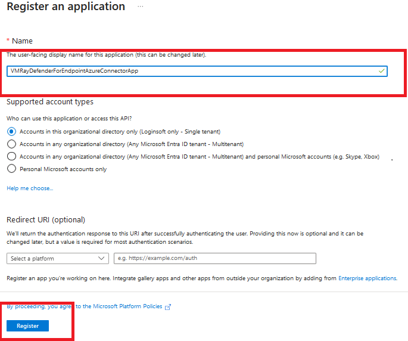
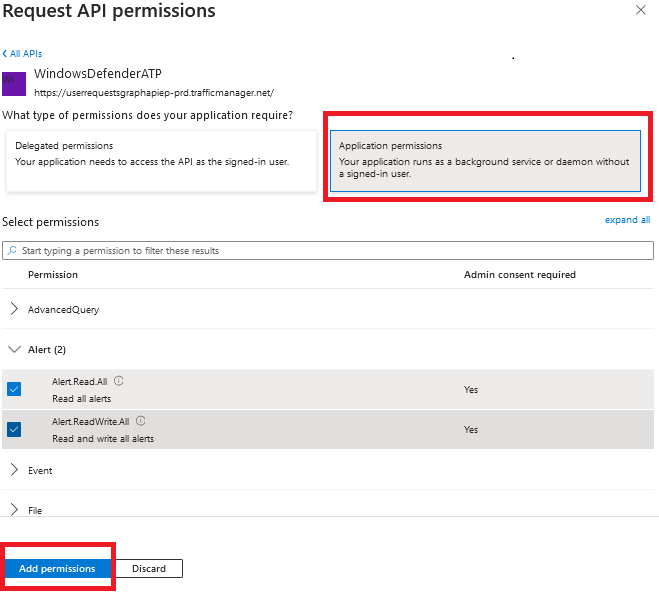
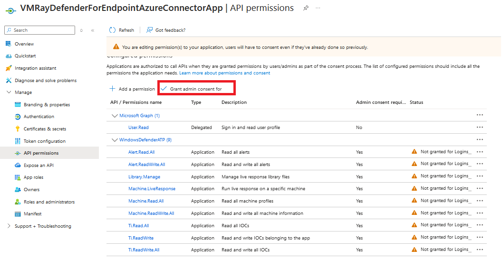
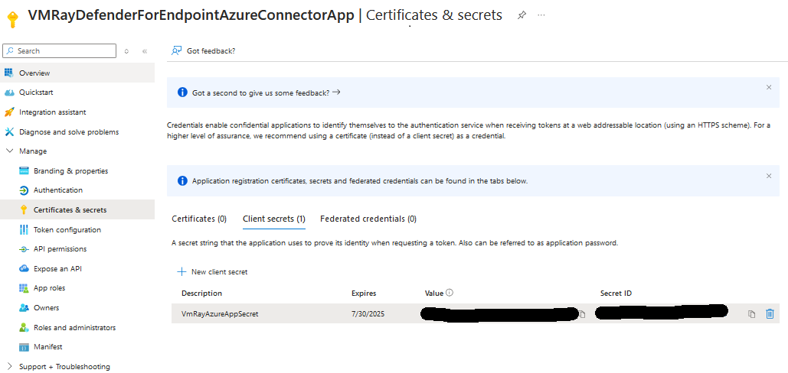

# Microsoft Defender for Endpoint Azure Connector for VMRay Advanced Malware Sandbox

**Latest Version:** beta - **Release Date:** 

## Overview

This project is an integration between Microsoft Defender for Endpoint and VMRay products: Analyzer, FinalVerdict and Totalinsight. 
The connector will collect alerts and related evidences, and query or submit these samples into VMRay Sandbox.
It accelerates the triage of alerts by adding comments to the alert in MS Defender Console with the analysis of the sample.
It also retrieves IOC values from VMRay and submits them into Microsoft Defender for Endpoint.

## Requirements
- Microsoft Defender for Endpoint
- VMRay Analyzer, VMRay FinalVerdict, VMRay TotalInsight
- Microsoft Azure

## Microsoft Defender for Endpoint Configurations

### Creating Application for API Access

- Open [https://portal.azure.com/](https://portal.azure.com) and search `Microsoft Entra ID` service

- Click `Add->App registration`

- Enter the name of application and select supported account types and click on `Register`

- In the application overview you can see `Application Name`, `Application ID` and `Tenant ID`

- After creating the application, we need to set API permissions for connector. For this purpose,
  - Click `Manage->API permissions` tab
  - Click `Add a permission` button
  - Select `APIs my organization uses`
  - Search `WindowsDefenderATP` and click the search result

- On the next page select `Application Permissions` and check permissions according to the table below. And click `Add permissions` button below.

|       Category       |   Permission Name   |    Description   |
|:---------------------|:--------------------|:---------------- |
| Alert                | Alert.Read.All      | Needed to retrieve alerts and related evidence  |
| Alert                | Alert.ReadWrite.All | Needed to enrich alerts with sample information  |
| Machine              | Machine.LiveResponse | Needed to gather evidences from machines |
| Machine              | Machine.Read.All | Needed to retrieve information about machines  |
| Ti                   | Ti.Read.All | Needed to retrieve indicators  |
| Ti                   | Ti.ReadWrite | Needed to retrieve and submit indicators (application specific)|
| Ti                   | Ti.ReadWrite.All | Needed to retrieve and submit indicators (general) |
| Library              | Library.Manage | Needed to upload custom ps1 script for retrieving av related evidences |

- After setting only the necessary permisions, click the `Grant admin consent for ...` button to approve permissions.

- We need to secrets to access programmatically. For creating secrets
  - Click `Manage->Certificates & secrets` tab
  - Click `Client secrets` tab
  - Click `New client secret` button
  - Enter description and set expiration date for secret

- Use Secret `Value` and `Secret ID` to configure connector.

**Reference**
- [https://docs.microsoft.com/en-us/microsoft-365/security/defender-endpoint/api-hello-world](https://docs.microsoft.com/en-us/microsoft-365/security/defender-endpoint/api-hello-world)

### Activating Live Response and Automated Investigation

- Open [https://security.microsoft.com](https://security.microsoft.com)
- Open `Settings` page and `Endpoint` tab
- Open `Advanced features`
- Activate `Automated Investigation`, `Live Response` and `Live Response for Servers` options

## Microsoft Azure Function App Installation And Configuration
### Deployment of Function App

- Open [https://portal.azure.com/](https://portal.azure.com) and search `Deploy a custom template` service

- On the next page select `Build your own template in the editor`
  

- Copy `azuredeploy.json` contents from the `FunctionApp` folder and save it.

- On the next page, please provide the values accordingly.

|       Fields       |   Description |
|:---------------------|:--------------------
| Subscription		| Select the appropriate Azure Subscription    | 
| Resource Group 	| Select the appropriate Resource Group |

## Microsoft Azure Logic App Installation And Configuration
## VMRay Configurations

- In VMRay Console, you must create two API Keys: Endpoint API key and Connector API key

The endpoint API key shall have minimal rights as it will be send to endpoint (within ps1 code) to allow them to upload samples to VMRay. Create it by following the steps below:
  1. Create a user dedicated for this API key (to avoid that the API key is deleted if an employee leaves)
  2. Create a role that allows to only "Submit sample, manage own jobs, reanalyse old analyses and regenerate analysis reports".
  3. Assign this role to the created user
  4. Login as this user and create an API key by opening Settings > Analysis > API Keys
  5. Set up a quota for this API key to detect the potential risk that the API key leaks and is used to overload VMRay by submitting dummy files

The Connector API key will stay in the connector and be used to fetch analysis.
Create it by following the steps below:
  1. Create a user dedicated for this API key (to avoid that the API key is deleted if an employee leaves)
  2. Create a role that allows to "View shared submission, analysis and sample" and "Submit sample, manage own jobs, reanalyse old analyses and regenerate analysis reports".
  3. Assign this role to the created user
  4. Login as this user and create an API key by opening Settings > Analysis > API Keys
